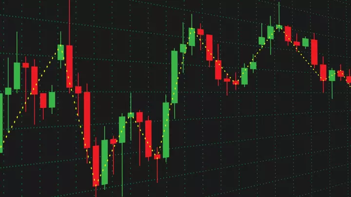

# Trading-Forex-With-Candles
This is an automated trading algorithm written in MetaQuotes Language 4 (MQL4) language to buy or sell ForEx (Foreign Exchange) orders based on candle charts as well as various input paramaters that can be specified by the user such as the number of retries, acceptable loss, and profit. 

You can compile this program by downloading CitiFX Pro from here and following the SignUp instructions: https://www.citigroup.com/citi/news/2009/091005b.htm 
Note : You will need Windows to run the program. 

